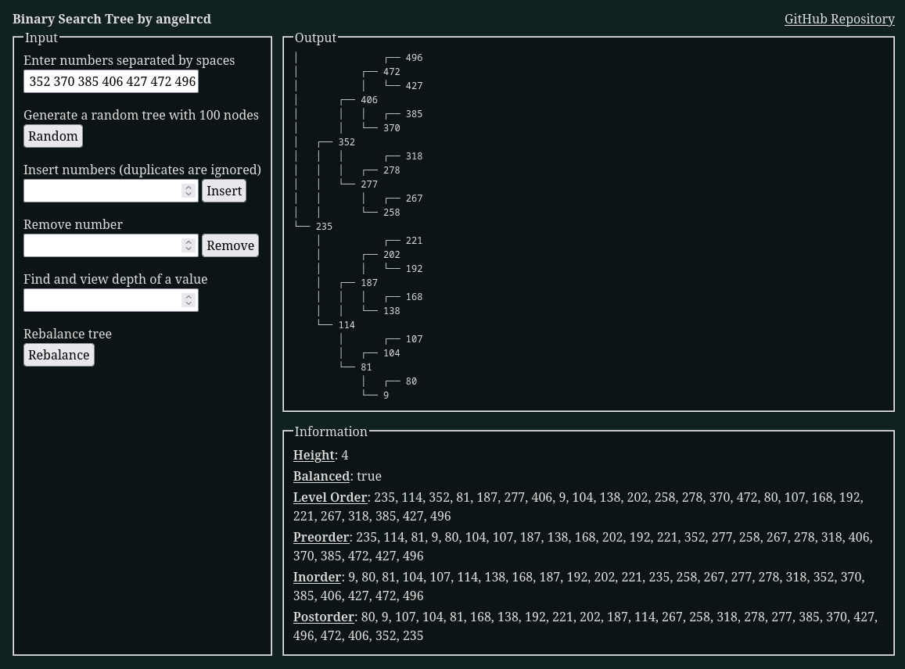

# Binary Search Tree
Binary Search Tree implemented with JavaScript

## Links
- [Linked List Visualizer](https://angelrcd.github.io/odin-binary-search-tree/)
- [Link to assignment](https://www.theodinproject.com/lessons/javascript-binary-search-trees)

## Summary
All of the Linked list related logic can be found in my `tree.js` file. This project contains two classes: `Node` and `Tree`

### Features
- `insert(value)` Inserts a new node with given value in the tree, duplicates are ignored
- `delete(value)` Deletes node with given value if it exists
- `find(value)` Searches for a node with the value and returns it if it's found
- `levelOrder(callback)` Traverses the tree in breadth-first level order and provides each node as the argument to the provided callback, if no callback it returns an array of values.
- `preorder(callback)` Traverses the tree in depth-first preorder and provides each node as the argument to the provided callback, if no callback it returns an array of values.
- `inorder(callback)` Traverses the tree in depth-first inorder and provides each node as the argument to the provided callback, if no callback it returns an array of values.
- `postorder(callback)` Traverses the tree in depth-first postorder and provides each node as the argument to the provided callback, if no callback it returns an array of values.
- `height(node)` Returns the height of a node, height is defined as the number of edges in longest path from a given node to a leaf node.
- `depth(node)` Returns the depth of a node, depth is defined as the number of edges in path from a given node to the tree’s root node.
- `isBalanced()` Checks if the tree is balanced. A balanced tree is one where the difference between heights of left subtree and right subtree of every node is not more than 1.
- `rebalance()` Rebalances an unbalanced tree.